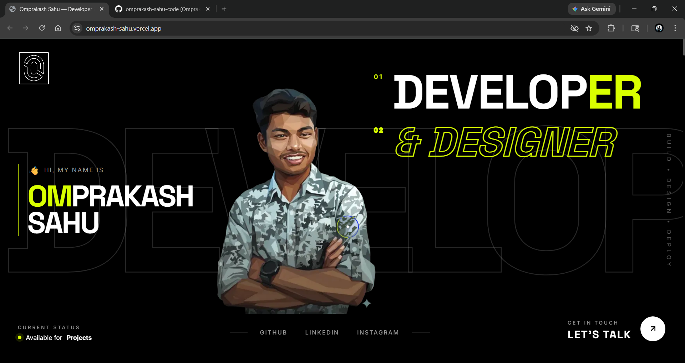
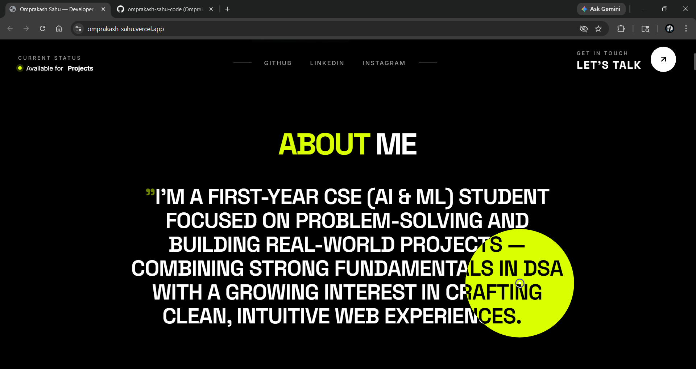
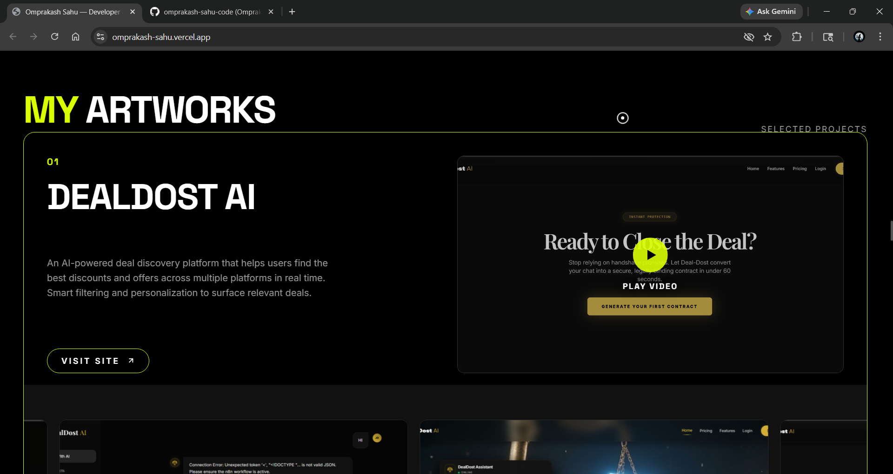
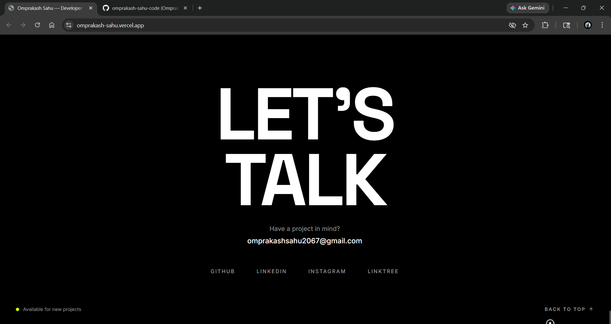

# 🚀 Portfolio Website

A modern, high-performance developer portfolio focused on **execution, interaction, and clean design**.

This project is not just a static portfolio — it reflects how I think, build, and ship ideas.

---

## 🌐 Live Demo

(https://omprakash-sahu.vercel.app/).

[NOTE: Open in desktop for best view]

---

## 📸 Preview

<table>
  <tr>
    <td></td>
    <td></td>
  </tr>
  <tr>
    <td></td>
    <td></td>
  </tr>
</table>

---

## ✨ Features

- ⚡ Smooth animations and transitions  
- 🎯 Custom cursor & interactive UI  
- 🧠 System-driven design approach  
- 📱 Responsive layout (optimized for desktop experience)  
- 🎨 Minimal, high-contrast visual style  
- 🚀 Performance-focused architecture  

---

## 🛠️ Tech Stack

- **Next.js** — app structure & routing  
- **React** — component architecture  
- **TypeScript** — type safety  
- **GSAP** — advanced animations  
- **Lenis** — smooth scrolling  
- **Vanilla CSS** — custom styling  

---

## 🧠 Approach

Instead of just building sections, I focused on:

- Thinking in systems (UI + interaction + performance)  
- Fast execution and iteration  
- Building experiences, not just pages  

---

## 🚧 Status 
⚠️ This project is still evolving and not fully complete. I continuously improve and refine it as I learn and build. 

---

## 🤝 Connect 
If you want to collaborate, discuss ideas, or just connect — feel free to reach out. 

---

## ⚙️ Getting Started

Clone the repository:

```bash
git clone https://github.com/omprakash-sahu-code/Portfolio-Website.git
cd Portfolio-Website
